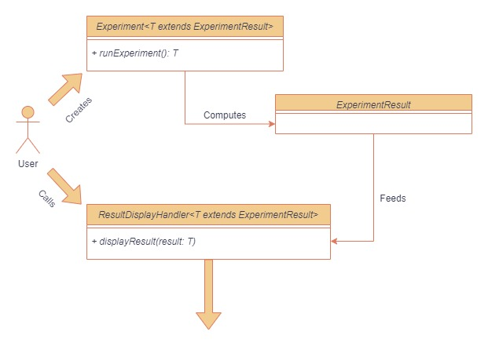
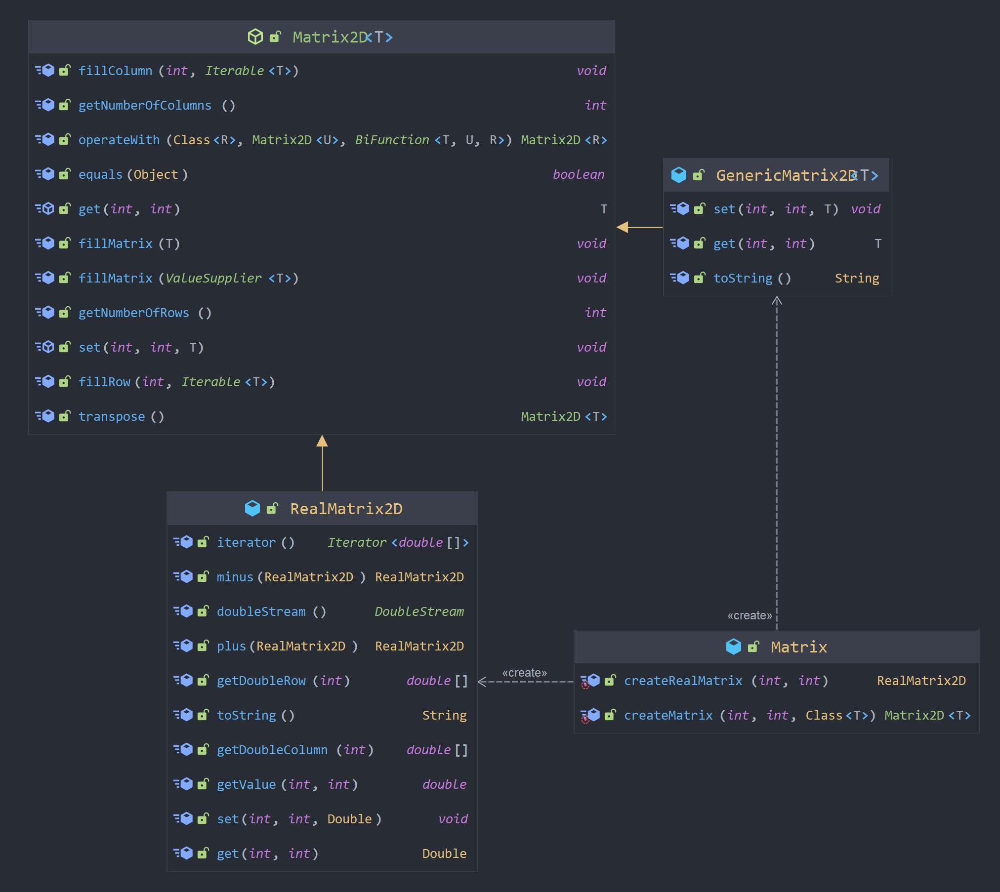

# Impact de la limitation de vitesse en environnement urbain sur la fluidité du trafic routier

> David Marembert - MP Info - 2023

## Motivations du TIPE

La sur-utilisation des véhicules personnels en ville est un si grand fléau pour la sécurité urbaine et
la congestion des villes, surtout si celles-ci ont été construites autour de la voiture, que de
nombreux projets visent à réduire leur omniprésence. Ainsi la moindre optimisation de notre
conduite pourrait être cruciale.\
La concentration de population intrinsèque aux villes crée les plus gros problèmes de trafic. Un
trajet dans une grosse agglomération revient souvent à passer plusieurs heures pour parcourir des
distances très faibles, au grand désarroi des riverains. C’est donc là qu’il faut étudier notre
conduite.

## Objectifs du TIPE

- [x] Conceptualiser une architecture informatique modélisant nos différents cas d'études, adaptable à
  d'éventuelles expériences futures, et respectant les conventions de la Programmation Orientée-Objet.
- [x] L'implémentation de ce programme dans le langage Java nous permettra d'explorer les différentes
  situations physiques du trafic routier.
- [x] La fiabilité de notre système et des différents modèles de
  conduite utilisés pourra être mesurée par comparaison aux résultats théoriques attendus selon la
  finesse des paramètres mis en jeu.
- [x] Dégager les différents liens observés entre vitesse, fluidité, et d’autres facteurs pour statuer sur
  notre capacité à juger l'argument de la décongestion des routes quant à la réduction de vitesse.

## Système d'*expériences*

## Système de matrices

